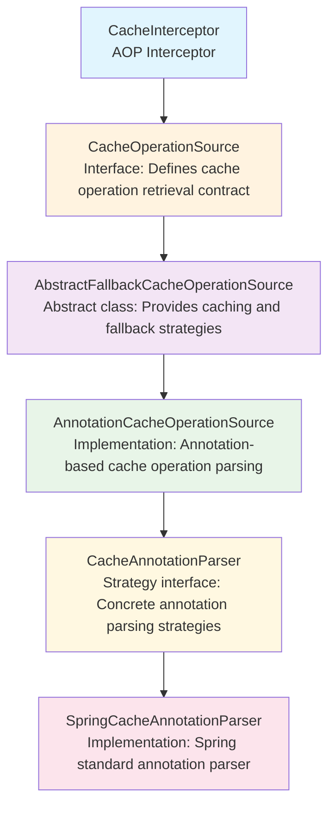
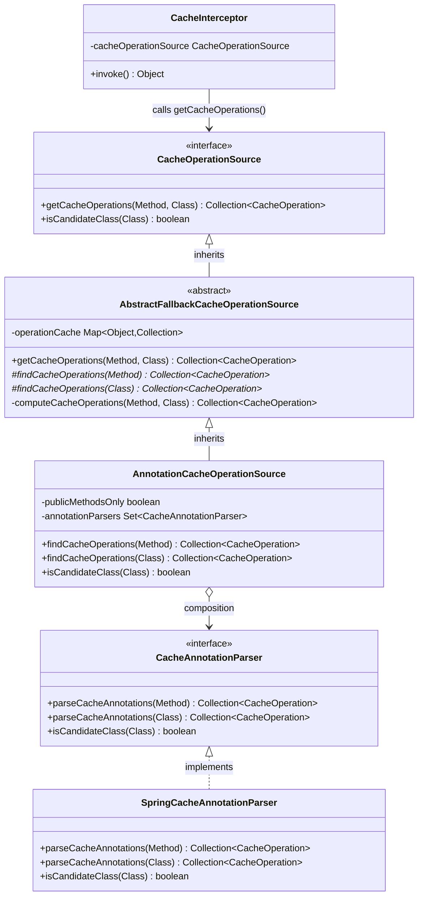
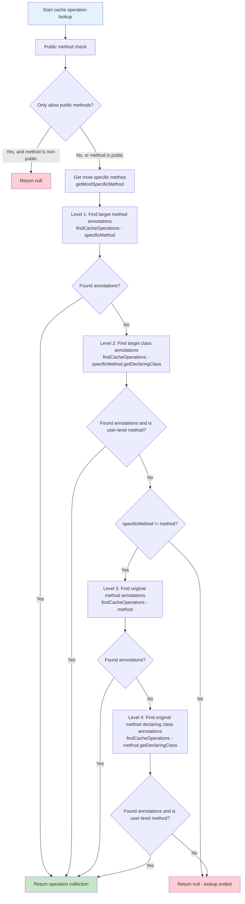
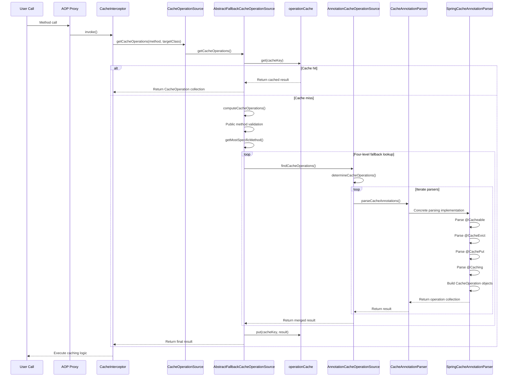
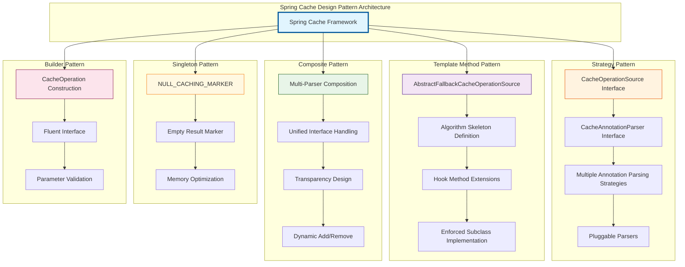
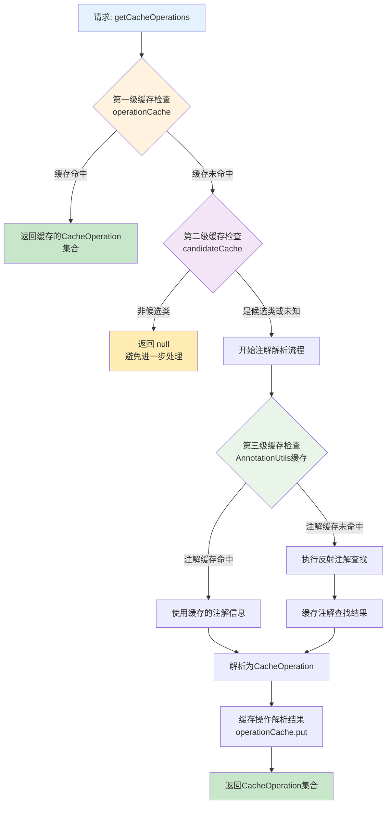
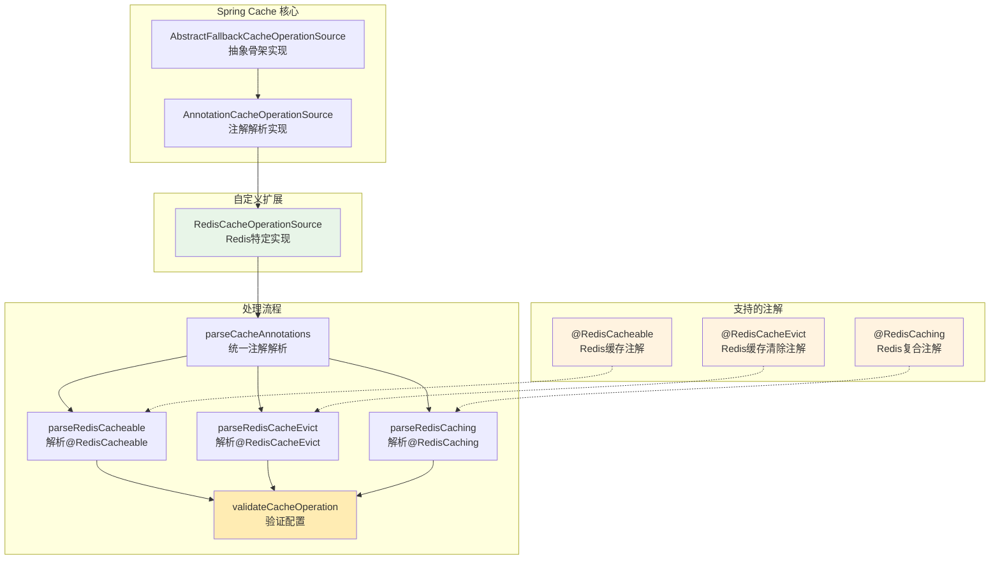
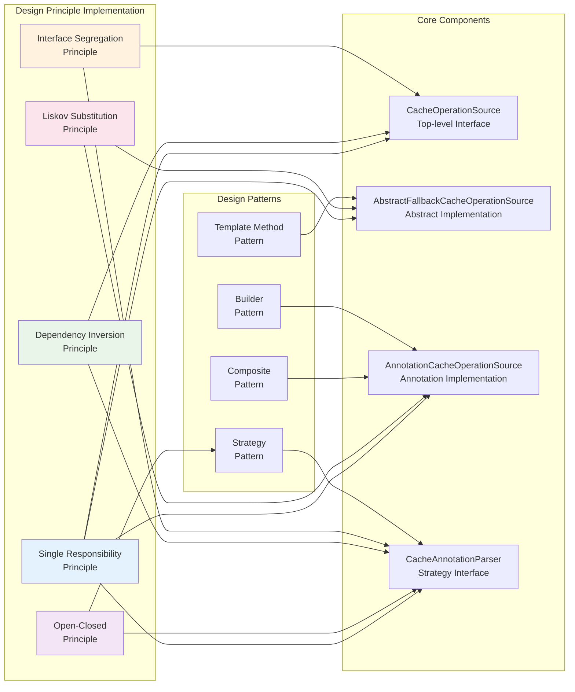

## Overview

This document provides an in-depth analysis of the core source code for annotation processing in the Spring Cache module, focusing on four key interfaces and classes: `CacheOperationSource`, `AbstractFallbackCacheOperationSource`, `AnnotationCacheOperationSource`, and `CacheAnnotationParser`. These components form the core infrastructure for Spring Cache annotation processing, and understanding their design and collaborative relationships is crucial for mastering how Spring Cache works.

## Component Overview

### Overall Architecture



### Component Relationship Diagram



## Detailed Component Analysis

### 1. CacheOperationSource - Top-Level Interface Definition

#### Core Responsibilities

`CacheOperationSource` serves as the top-level interface in the Spring Cache system, defining the core contract for retrieving cache operation metadata.

#### Key Design Patterns

Uses the **Strategy Pattern** to provide a unified interface for different cache operation retrieval strategies (such as annotation-based, XML configuration, etc.).

#### Source Code Analysis Points

**Interface Definition Analysis:**

```java
public interface CacheOperationSource {

    // Core method: get collection of cache operations for a method
    @Nullable
    Collection<CacheOperation> getCacheOperations(Method method, @Nullable Class<?> targetClass);

    // Optimization method: determine if class is a candidate to avoid unnecessary method traversal
    default boolean isCandidateClass(Class<?> targetClass) {
        return true;
    }
}
```

**Method Signature Analysis:**

1. **`getCacheOperations(Method method, @Nullable Class<?> targetClass)`**

- **Input Parameters**:
    - `method`: Target method to analyze, never null
    - `targetClass`: Target class, may be null (uses method's declaring class when null)
- **Return Value**: `Collection<CacheOperation>` - All cache operations associated with the method, returns null if no cache operations found
- **Semantics**: This is the entry point for the entire caching framework, responsible for converting method calls into concrete cache operation instructions

2. **`isCandidateClass(Class<?> targetClass)`**

- **Optimization Purpose**: Quickly determine if a class might contain cache annotations before traversing all its methods
- **Performance Consideration**: Returning false allows skipping the entire class, avoiding expensive method-level checks
- **Default Implementation**: Returns true, meaning full checking is required (conservative strategy)

### 2. AbstractFallbackCacheOperationSource - Abstract Skeleton Implementation

#### Core Responsibilities

`AbstractFallbackCacheOperationSource` serves as a skeleton implementation, providing caching mechanisms and fallback lookup strategies, which is a classic application of the Template Method pattern.

#### Key Design Patterns

Uses the **Template Method Pattern** to define the algorithm skeleton for cache operation retrieval, deferring specific lookup logic to subclass implementations.

#### Source Code Analysis Points

**Core Field Analysis:**

```java
public abstract class AbstractFallbackCacheOperationSource implements CacheOperationSource {

    // Empty marker used to identify methods with no cache operations found, avoiding repeated lookups
    private static final Collection<CacheOperation> NULL_CACHING_MARKER = Collections.emptyList();

    // Operation cache: avoid repeatedly parsing cache operations for the same method
    // Key: MethodClassKey(method, targetClass)
    // Value: Collection<CacheOperation> or NULL_CACHING_MARKER
    private final Map<Object, Collection<CacheOperation>> operationCache = new ConcurrentHashMap<>(1024);
}
```

**Caching Mechanism Design Analysis:**

1. **Why do we need `operationCache`?**

- **Performance Optimization**: Annotation parsing is relatively expensive (involves reflection, annotation lookup, etc.)
- **Frequent Calls**: The same method will be called multiple times during application runtime
- **Immutability**: Method cache operations are immutable at runtime, suitable for caching

2. **The role of `NULL_CACHING_MARKER`:**

- **Avoid Repeated Lookups**: For methods that don't contain cache annotations, avoid going through the complete parsing process each time
- **State Distinction**: Distinguish between "not yet searched" and "searched but not found" states
- **Memory Optimization**: Use singleton empty collection to save memory space

**getCacheOperations Method Implementation Analysis:**

```java
@Override
@Nullable
public Collection<CacheOperation> getCacheOperations(Method method, @Nullable Class<?> targetClass) {
    // 1. Exclude Object class methods (such as toString, equals, etc.)
    if (method.getDeclaringClass() == Object.class) {
        return null;
    }

    // 2. Generate cache key
    Object cacheKey = getCacheKey(method, targetClass);

    // 3. Check cache
    Collection<CacheOperation> cached = this.operationCache.get(cacheKey);

    if (cached != null) {
        // 4. Cache hit: return actual result or null (if NULL_CACHING_MARKER)
        return (cached != NULL_CACHING_MARKER ? cached : null);
    }
    else {
        // 5. Cache miss: execute actual lookup logic
        Collection<CacheOperation> cacheOps = computeCacheOperations(method, targetClass);

        // 6. Cache result
        if (cacheOps != null) {
            this.operationCache.put(cacheKey, cacheOps);
        }
        else {
            // Cache "not found" result to avoid repeated lookups
            this.operationCache.put(cacheKey, NULL_CACHING_MARKER);
        }
        return cacheOps;
    }
}
```

**Cache Key Generation Strategy:**

```java
protected Object getCacheKey(Method method, @Nullable Class<?> targetClass) {
    return new MethodClassKey(method, targetClass);
}
```

- **Uniqueness Guarantee**: `MethodClassKey` ensures different methods produce different keys, and the same method produces the same key
- **Method Overloading Support**: Can correctly distinguish method overloading scenarios
- **Proxy Compatibility**: Considers AOP proxy situations where `targetClass` may differ from `method.getDeclaringClass()`

**Fallback Lookup Strategy Analysis:**

```java
@Nullable
private Collection<CacheOperation> computeCacheOperations(Method method, @Nullable Class<?> targetClass) {
    // 1. Public method check
    if (allowPublicMethodsOnly() && !Modifier.isPublic(method.getModifiers())) {
        return null;
    }

    // 2. Get the most specific method (handle interface proxy cases)
    Method specificMethod = AopUtils.getMostSpecificMethod(method, targetClass);

    // 3. Four-level fallback lookup strategy:

    // Level 1: Look for annotations on the target method
    Collection<CacheOperation> opDef = findCacheOperations(specificMethod);
    if (opDef != null) {
        return opDef;
    }

    // Level 2: Look for annotations on the target class
    opDef = findCacheOperations(specificMethod.getDeclaringClass());
    if (opDef != null && ClassUtils.isUserLevelMethod(method)) {
        return opDef;
    }

    // Level 3: If method is different, look for annotations on the original method
    if (specificMethod != method) {
        opDef = findCacheOperations(method);
        if (opDef != null) {
            return opDef;
        }

        // Level 4: Look for annotations on the original method's declaring class
        opDef = findCacheOperations(method.getDeclaringClass());
        if (opDef != null && ClassUtils.isUserLevelMethod(method)) {
            return opDef;
        }
    }

    return null;
}
```

**Design Philosophy of Fallback Strategy:**

1. **Decreasing Priority**: Method-level annotations > Class-level annotations > Interface method annotations > Interface class annotations
2. **Proximity Principle**: Annotations closer to the actual call point have higher priority
3. **Override Mechanism**: Method-level annotations completely override class-level annotations, rather than merging
4. **Proxy Compatibility**: Correctly handles JDK dynamic proxy and CGLIB proxy scenarios

**Four-Level Fallback Lookup Strategy Flowchart:**



**Template Method Manifestation:**

```java
// Abstract methods: concrete lookup logic implemented by subclasses
@Nullable
protected abstract Collection<CacheOperation> findCacheOperations(Class<?> clazz);

@Nullable
protected abstract Collection<CacheOperation> findCacheOperations(Method method);
```

### 3. AnnotationCacheOperationSource - Standard Annotation Parsing Implementation

#### Core Responsibilities

`AnnotationCacheOperationSource` serves as an annotation-based cache operation parser, utilizing the Strategy pattern to collaborate with multiple `CacheAnnotationParser` instances, supporting different types of cache annotations.

#### Key Design Patterns

Uses **Strategy Pattern + Composite Pattern**, combining multiple annotation parsing strategies to support different annotation systems (such as Spring standard annotations, JCache annotations, etc.).

#### Source Code Analysis Points

**Core Fields and Constructor Analysis:**

```java
public class AnnotationCacheOperationSource extends AbstractFallbackCacheOperationSource implements Serializable {

    private final boolean publicMethodsOnly;
    private final Set<CacheAnnotationParser> annotationParsers;

    // Default constructor: only supports public methods, uses Spring standard annotation parser
    public AnnotationCacheOperationSource() {
        this(true);
    }

    // Basic constructor: configure method visibility, defaults to Spring standard annotation parser
    public AnnotationCacheOperationSource(boolean publicMethodsOnly) {
        this.publicMethodsOnly = publicMethodsOnly;
        this.annotationParsers = Collections.singleton(new SpringCacheAnnotationParser());
    }

    // Custom parser constructor: supports single custom parser
    public AnnotationCacheOperationSource(CacheAnnotationParser annotationParser) {
        this.publicMethodsOnly = true;
        Assert.notNull(annotationParser, "CacheAnnotationParser must not be null");
        this.annotationParsers = Collections.singleton(annotationParser);
    }

    // Multi-parser constructor: supports multiple parser combination
    public AnnotationCacheOperationSource(Set<CacheAnnotationParser> annotationParsers) {
        this.publicMethodsOnly = true;
        Assert.notEmpty(annotationParsers, "At least one CacheAnnotationParser needs to be specified");
        this.annotationParsers = annotationParsers;
    }
}
```

**Constructor Design Analysis:**

1. **Progressive Complexity**: From simple default configuration to fully customized configuration
2. **Reasonable Defaults**: Defaults to processing only public methods, using Spring standard parser
3. **Extensibility Support**: Supports adding custom parsers, supports multi-parser combination
4. **Parameter Validation**: Ensures parser collection is not empty, demonstrating defensive programming

**Candidate Class Check Implementation:**

```java
@Override
public boolean isCandidateClass(Class<?> targetClass) {
    for (CacheAnnotationParser parser : this.annotationParsers) {
        if (parser.isCandidateClass(targetClass)) {
            return true;
        }
    }
    return false;
}
```

- **Short-Circuit Optimization**: Returns true as soon as any parser considers it a candidate class
- **Delegation Pattern**: Delegates specific judgment logic to individual parsers
- **Performance Optimization**: Avoids expensive method traversal on irrelevant classes

**核心解析方法实现：**

```java
@Override
@Nullable
protected Collection<CacheOperation> findCacheOperations(Class<?> clazz) {
    return determineCacheOperations(parser -> parser.parseCacheAnnotations(clazz));
}

@Override
@Nullable
protected Collection<CacheOperation> findCacheOperations(Method method) {
    return determineCacheOperations(parser -> parser.parseCacheAnnotations(method));
}
```

**策略模式的核心实现：**

```java
@Nullable
protected Collection<CacheOperation> determineCacheOperations(CacheOperationProvider provider) {
    Collection<CacheOperation> ops = null;

    // 遍历所有注解解析器
    for (CacheAnnotationParser parser : this.annotationParsers) {
        // 使用当前解析器解析注解
        Collection<CacheOperation> annOps = provider.getCacheOperations(parser);

        if (annOps != null) {
            if (ops == null) {
                // 第一次发现操作
                ops = annOps;
            }
            else {
                // 合并多个解析器的结果
                Collection<CacheOperation> combined = new ArrayList<>(ops.size() + annOps.size());
                combined.addAll(ops);
                combined.addAll(annOps);
                ops = combined;
            }
        }
    }
    return ops;
}
```

**函数式接口设计：**

```java
@FunctionalInterface
protected interface CacheOperationProvider {
    @Nullable
    Collection<CacheOperation> getCacheOperations(CacheAnnotationParser parser);
}
```

**determineCacheOperations方法的设计亮点：**

1. **函数式编程**：使用`CacheOperationProvider`函数式接口，提高代码复用性
2. **延迟计算**：只有在需要时才创建合并集合
3. **内存优化**：当只有一个解析器有结果时，直接返回原集合，避免不必要的复制
4. **结果合并**：支持多个解析器的结果合并，实现注解体系的扩展

### 4. CacheAnnotationParser - 策略接口扩展点

#### 核心职责

`CacheAnnotationParser`作为注解解析的策略接口，为Spring Cache体系提供了强大的扩展点，支持不同的注解标准和自定义注解。

#### 关键设计模式

采用**策略模式**，为不同的注解解析策略提供统一接口，是整个注解体系扩展性的关键。

#### 源码分析要点

**接口定义分析：**

```java
public interface CacheAnnotationParser {

    // 候选类检查：性能优化的关键
    default boolean isCandidateClass(Class<?> targetClass) {
        return true;
    }

    // 解析类级别的缓存注解
    @Nullable
    Collection<CacheOperation> parseCacheAnnotations(Class<?> type);

    // 解析方法级别的缓存注解
    @Nullable
    Collection<CacheOperation> parseCacheAnnotations(Method method);
}
```

**接口设计的扩展性体现：**

1. **`isCandidateClass`方法的意义：**

```java
default boolean isCandidateClass(Class<?> targetClass) {
    return true;  // 保守的默认实现
}
```

- **性能优化作用**：在解析注解之前快速过滤无关的类
- **默认实现**：返回true确保向后兼容
- **自定义空间**：子类可以根据注解特征实现快速判断逻辑

2. **`parseCacheAnnotations`方法的统一性：**

- **一致的方法签名**：类和方法级别的解析采用相同的返回类型
- **null语义**：返回null表示没有找到相关注解
- **集合返回**：支持一个元素上有多个缓存操作（如@Caching注解）

**SpringCacheAnnotationParser实现示例：**

```java
public class SpringCacheAnnotationParser implements CacheAnnotationParser {

    @Override
    public boolean isCandidateClass(Class<?> targetClass) {
        // 检查类上是否有Spring Cache相关注解
        return AnnotationUtils.isCandidateClass(targetClass, CACHE_OPERATION_ANNOTATIONS);
    }

    @Override
    @Nullable
    public Collection<CacheOperation> parseCacheAnnotations(Class<?> type) {
        DefaultCacheConfig defaultConfig = new DefaultCacheConfig(type);
        return parseCacheAnnotations(defaultConfig, type);
    }

    @Override
    @Nullable
    public Collection<CacheOperation> parseCacheAnnotations(Method method) {
        DefaultCacheConfig defaultConfig = new DefaultCacheConfig(method.getDeclaringClass());
        return parseCacheAnnotations(defaultConfig, method);
    }
}
```

**扩展点的价值：**

1. **多标准支持**：可以同时支持Spring Cache注解、JCache注解、自定义注解
2. **渐进迁移**：支持从一种注解标准向另一种标准迁移
3. **业务定制**：支持根据业务需求定制特殊的缓存注解
4. **第三方集成**：第三方缓存框架可以通过实现此接口集成到Spring Cache体系

## Complete Call Chain Analysis

### Method Call Sequence Diagram



### Key Call Path Details

1. **Entry Call:**

```java
// In CacheInterceptor.invoke()
Collection<CacheOperation> operations = getCacheOperationSource()
    .getCacheOperations(method, targetClass);
```

2. **Cache Lookup:**

```java
// AbstractFallbackCacheOperationSource.getCacheOperations()
Object cacheKey = getCacheKey(method, targetClass);
Collection<CacheOperation> cached = this.operationCache.get(cacheKey);
```

3. **Fallback Parsing:**

```java
// Four-level fallback strategy
Collection<CacheOperation> opDef = findCacheOperations(specificMethod);
if (opDef != null) return opDef;
// ... other levels of fallback
```

4. **Strategy Delegation:**

```java
// AnnotationCacheOperationSource.determineCacheOperations()
for (CacheAnnotationParser parser : this.annotationParsers) {
    Collection<CacheOperation> annOps = provider.getCacheOperations(parser);
    // Merge results...
}
```

5. **Annotation Parsing:**

```java
// SpringCacheAnnotationParser.parseCacheAnnotations()
Cacheable cacheable = AnnotatedElementUtils.findMergedAnnotation(method, Cacheable.class);
if (cacheable != null) {
    ops.add(parseCacheableAnnotation(cacheable, method));
}
```

## Design Patterns In-Depth Analysis

**Overview of Design Patterns Applied in Spring Cache Architecture:**



### 1. Template Method Pattern Application in AbstractFallbackCacheOperationSource

**Template Structure:**

```java
public abstract class AbstractFallbackCacheOperationSource {

    // Template method: define algorithm skeleton
    public final Collection<CacheOperation> getCacheOperations(Method method, Class<?> targetClass) {
        // 1. Preprocessing: check Object class methods
        // 2. Cache lookup
        // 3. If cache miss, call computeCacheOperations
        // 4. Result caching
    }

    // Hook method: behavior that subclasses can override
    protected boolean allowPublicMethodsOnly() {
        return false;
    }

    // Abstract methods: enforced subclass implementation
    protected abstract Collection<CacheOperation> findCacheOperations(Class<?> clazz);
    protected abstract Collection<CacheOperation> findCacheOperations(Method method);
}
```

**Advantage Analysis:**

1. **Algorithm Reuse**: Caching logic and fallback strategies are identical across all subclasses
2. **Clear Extension Points**: Subclasses only need to focus on specific annotation lookup logic
3. **Consistency Guarantee**: All implementations follow the same execution flow

### 2. 策略模式在注解解析中的应用

**策略接口：**

```java
public interface CacheAnnotationParser {
    Collection<CacheOperation> parseCacheAnnotations(Class<?> type);
    Collection<CacheOperation> parseCacheAnnotations(Method method);
}
```

**策略上下文：**

```java
public class AnnotationCacheOperationSource {
    private final Set<CacheAnnotationParser> annotationParsers;

    protected Collection<CacheOperation> determineCacheOperations(CacheOperationProvider provider) {
        // 遍历所有策略，合并结果
    }
}
```

**具体策略：**

- `SpringCacheAnnotationParser`：处理Spring标准注解
- `JCacheAnnotationParser`：处理JCache标准注解
- 自定义解析器：处理业务特定注解

**优势分析：**

1. **开闭原则**：可以添加新的注解标准而不修改现有代码
2. **职责分离**：每个解析器只关注特定的注解类型
3. **组合灵活**：可以同时使用多种注解标准

### 3. 组合模式的应用

**组合结构：**

```java
AnnotationCacheOperationSource {
    Set<CacheAnnotationParser> annotationParsers;  // 叶子节点集合

    determineCacheOperations() {
        // 遍历所有叶子节点，收集结果
        for (CacheAnnotationParser parser : annotationParsers) {
            // 调用叶子节点的处理方法
        }
    }
}
```

**优势分析：**

1. **统一处理**：对单个解析器和解析器集合使用相同的接口
2. **透明性**：客户端不需要知道是在处理单个解析器还是解析器集合
3. **扩展性**：可以动态添加或移除解析器

## Performance Optimization Strategy Analysis

### 1. Multi-Level Cache Design

**Cache Hierarchy:**

```java
// Level 1: Operation result cache
private final Map<Object, Collection<CacheOperation>> operationCache;

// Level 2: Candidate class pre-check cache (may exist in actual implementation)
private final Map<Class<?>, Boolean> candidateCache;

// Level 3: Annotation lookup result cache (in AnnotationUtils)
```

**多级缓存架构图：**



**缓存键设计：**

```java
protected Object getCacheKey(Method method, @Nullable Class<?> targetClass) {
    return new MethodClassKey(method, targetClass);
}
```

- **唯一性**：确保不同方法有不同的键
- **一致性**：相同方法始终产生相同的键
- **高效性**：基于方法和类的hashCode计算

### 2. 延迟计算和短路优化

**候选类短路：**

```java
public boolean isCandidateClass(Class<?> targetClass) {
    for (CacheAnnotationParser parser : this.annotationParsers) {
        if (parser.isCandidateClass(targetClass)) {
            return true;  // 短路返回
        }
    }
    return false;
}
```

**空结果标记：**

```java
private static final Collection<CacheOperation> NULL_CACHING_MARKER = Collections.emptyList();

// 避免重复查找已知无结果的方法
if (cached != null) {
    return (cached != NULL_CACHING_MARKER ? cached : null);
}
```

### 3. 内存优化

**集合复用：**

```java
// 只有在需要合并时才创建新集合
if (ops == null) {
    ops = annOps;  // 直接引用，避免复制
}
else {
    // 确实需要合并时才创建新集合
    Collection<CacheOperation> combined = new ArrayList<>(ops.size() + annOps.size());
    combined.addAll(ops);
    combined.addAll(annOps);
    ops = combined;
}
```

**不可变集合：**

```java
return Collections.unmodifiableList(ops);  // 返回不可变视图，防止意外修改
```

## Practical Case Study: RedisCacheOperationSource

To better understand how to implement a custom `CacheOperationSource`, let's analyze a practical case: `RedisCacheOperationSource` from the CacheGuard project. This implementation demonstrates how to extend Spring Cache to support Redis-specific caching functionality.

### Case Study Overview

`RedisCacheOperationSource` extends `AnnotationCacheOperationSource`, supporting custom Redis cache annotations such as `@RedisCacheable`, `@RedisCacheEvict`, and `@RedisCaching`. This implementation showcases several key design principles:

1. **Extension Rather Than Replacement**: Extending existing Spring Cache infrastructure
2. **Custom Annotation Support**: Handling Redis-specific cache annotations
3. **Comprehensive Validation**: Providing robust error checking and logging
4. **Composite Annotation Handling**: Supporting complex annotation combinations

**RedisCacheOperationSource 架构图：**



### 实现分析

#### 1. 核心结构

```java
@Slf4j
public class RedisCacheOperationSource extends AnnotationCacheOperationSource {

    public RedisCacheOperationSource() {
        super(false);  // 允许非公共方法
    }

    @Override
    protected Collection<CacheOperation> findCacheOperations(Method method) {
        return parseCacheAnnotations(method);
    }

    @Override
    protected Collection<CacheOperation> findCacheOperations(Class<?> clazz) {
        return parseCacheAnnotations(clazz);
    }
}
```

**设计决策：**

- **构造函数参数**：`super(false)`允许处理非公共方法，提供比Spring默认行为更大的灵活性
- **模板方法实现**：重写父类的抽象方法，委托给自定义的解析逻辑
- **统一解析**：使用单个`parseCacheAnnotations(Object target)`方法处理类和方法目标

#### 2. 自定义注解解析策略

```java
@Nullable
private Collection<CacheOperation> parseCacheAnnotations(Object target) {
    List<CacheOperation> ops = new ArrayList<>();
    log.trace("Parsing cache annotations for target: {}", target);

    // 处理 @RedisCacheable 注解
    RedisCacheable cacheable = null;
    if (target instanceof Method) {
        cacheable = AnnotatedElementUtils.findMergedAnnotation(
                (Method) target, RedisCacheable.class);
    } else if (target instanceof Class) {
        cacheable = AnnotatedElementUtils.findMergedAnnotation(
                (Class<?>) target, RedisCacheable.class);
    }

    if (cacheable != null) {
        log.debug("Found @RedisCacheable annotation on target: {}", target);
        CacheOperation operation = parseRedisCacheable(cacheable, target);
        validateCacheOperation(target, operation);
        ops.add(operation);
    }

    // 处理 @RedisCaching 复合注解
    RedisCaching caching = null;
    if (target instanceof Method) {
        caching = AnnotatedElementUtils.findMergedAnnotation((Method) target, RedisCaching.class);
    } else if (target instanceof Class) {
        caching = AnnotatedElementUtils.findMergedAnnotation((Class<?>) target, RedisCaching.class);
    }

    if (caching != null) {
        log.debug("Found @RedisCaching annotation on target: {}", target);
        // 处理多个嵌套注解
        for (RedisCacheable c : caching.redisCacheable()) {
            CacheOperation operation = parseRedisCacheable(c, target);
            validateCacheOperation(target, operation);
            ops.add(operation);
        }
        for (RedisCacheEvict e : caching.redisCacheEvict()) {
            RedisCacheEvictOperation operation = parseRedisCacheEvict(e, target);
            validateCacheOperation(target, operation);
            ops.add(operation);
        }
    }

    return ops.isEmpty() ? null : Collections.unmodifiableList(ops);
}
```

**应用的关键设计模式：**

1. **多态目标处理**：使用`Object target`参数统一处理`Method`和`Class`类型
2. **合并注解支持**：使用`AnnotatedElementUtils.findMergedAnnotation()`支持注解继承和元注解
3. **组合模式**：通过相同接口处理单个注解和复合注解
4. **防御性编程**：每一步都进行全面的日志记录和验证

#### 3. 注解到操作的转换

```java
private CacheOperation parseRedisCacheable(RedisCacheable ann, Object target) {
    String name = (target instanceof Method) ? ((Method) target).getName() : target.toString();
    log.trace("Parsing @RedisCacheable annotation for target: {}", target);

    // 使用标准的Spring CacheableOperation.Builder
    CacheableOperation.Builder builder = new CacheableOperation.Builder();
    builder.setName(name);
    builder.setCacheNames(ann.value().length > 0 ? ann.value() : ann.cacheNames());

    // 仅在存在时设置key
    if (StringUtils.hasText(ann.key())) {
        builder.setKey(ann.key());
    }

    // 仅在存在时设置condition
    if (StringUtils.hasText(ann.condition())) {
        builder.setCondition(ann.condition());
    }

    builder.setSync(ann.sync());

    // 仅在指定时设置keyGenerator
    if (StringUtils.hasText(ann.keyGenerator())) {
        builder.setKeyGenerator(ann.keyGenerator());
    }

    CacheableOperation operation = builder.build();
    log.debug("Built CacheableOperation: {}", operation);
    return operation;
}
```

**建造者模式的卓越应用：**

- **流畅接口**：使用Spring内置的`CacheableOperation.Builder`实现清晰、可读的代码
- **条件设置**：仅在有意义的值时设置属性，避免空字符串污染
- **标准兼容**：重用Spring的标准操作类以实现最大兼容性

#### 4. 全面的验证框架

```java
private void validateCacheOperation(Object target, CacheOperation operation) {
    log.trace("Validating cache operation for target: {}", target);

    // 验证key与keyGenerator的互斥性
    if (StringUtils.hasText(operation.getKey()) &&
        StringUtils.hasText(operation.getKeyGenerator())) {
        String errorMsg = "Invalid cache annotation configuration on '" + target +
                         "'. Both 'key' and 'keyGenerator' attributes have been set. " +
                         "These attributes are mutually exclusive...";
        log.error(errorMsg);
        throw new IllegalStateException(errorMsg);
    }

    // 验证缓存名称的存在性
    if (operation.getCacheNames().isEmpty()) {
        String errorMsg = "Invalid cache annotation configuration on '" + target +
                         "'. At least one cache name must be specified.";
        log.error(errorMsg);
        throw new IllegalStateException(errorMsg);
    }

    log.debug("Cache operation validation passed for target: {}", target);
}
```

**验证策略的优势：**

1. **早期错误检测**：在启动时而非运行时捕获配置错误
2. **清晰的错误消息**：提供详细的、可操作的错误消息
3. **快速失败原则**：对无效配置抛出`IllegalStateException`
4. **全面覆盖**：验证所有关键配置组合

### 案例研究中的设计模式应用

#### 1. 模板方法模式的使用

```java
public class RedisCacheOperationSource extends AnnotationCacheOperationSource {
    // 从父类继承缓存和回退逻辑

    @Override
    protected Collection<CacheOperation> findCacheOperations(Method method) {
        return parseCacheAnnotations(method);  // 自定义实现
    }

    @Override
    protected Collection<CacheOperation> findCacheOperations(Class<?> clazz) {
        return parseCacheAnnotations(clazz);   // 自定义实现
    }
}
```

**实现的优势：**

- **代码复用**：继承父类的缓存、回退和性能优化
- **专注核心逻辑**：只需实现注解解析逻辑
- **一致性**：遵循与标准Spring实现相同的执行模式

#### 2. 多注解的策略模式

```java
private Collection<CacheOperation> parseCacheAnnotations(Object target) {
    List<CacheOperation> ops = new ArrayList<>();

    // 策略1：处理@RedisCacheable
    RedisCacheable cacheable = findAnnotation(target, RedisCacheable.class);
    if (cacheable != null) {
        ops.add(parseRedisCacheable(cacheable, target));
    }

    // 策略2：处理@RedisCacheEvict
    RedisCacheEvict cacheEvict = findAnnotation(target, RedisCacheEvict.class);
    if (cacheEvict != null) {
        ops.add(parseRedisCacheEvict(cacheEvict, target));
    }

    // 策略3：处理@RedisCaching复合注解
    RedisCaching caching = findAnnotation(target, RedisCaching.class);
    if (caching != null) {
        // 处理多个嵌套注解
    }

    return ops.isEmpty() ? null : Collections.unmodifiableList(ops);
}
```

### 案例研究的关键要点

1. **扩展策略**：扩展`AnnotationCacheOperationSource`最大化利用Spring现有基础设施
2. **验证重要性**：全面验证防止运行时错误并提供清晰反馈
3. **日志策略**：多级日志支持开发和生产调试
4. **模式应用**：实际实现展示了模板方法、策略和建造者模式的有效使用
5. **性能意识**：高效的注解处理和内存管理对高性能应用至关重要

这个案例研究展示了Spring Cache架构的理论概念如何转化为实际的、可用于生产的实现，扩展和增强了框架的能力。

## Extension and Customization Guide

### 1. Custom CacheAnnotationParser

```java
public class CustomCacheAnnotationParser implements CacheAnnotationParser {

    @Override
    public boolean isCandidateClass(Class<?> targetClass) {
        // Quick check for custom annotations
        return AnnotationUtils.isCandidateClass(targetClass, CustomCacheable.class);
    }

    @Override
    public Collection<CacheOperation> parseCacheAnnotations(Class<?> type) {
        CustomCacheable annotation = AnnotationUtils.findAnnotation(type, CustomCacheable.class);
        if (annotation != null) {
            return Collections.singletonList(buildCacheOperation(annotation));
        }
        return null;
    }

    @Override
    public Collection<CacheOperation> parseCacheAnnotations(Method method) {
        CustomCacheable annotation = AnnotationUtils.findAnnotation(method, CustomCacheable.class);
        if (annotation != null) {
            return Collections.singletonList(buildCacheOperation(annotation));
        }
        return null;
    }

    private CacheOperation buildCacheOperation(CustomCacheable annotation) {
        // Build custom CacheOperation
        return new CacheableOperation.Builder()
            .setName(annotation.value())
            .setCacheNames(annotation.cacheNames())
            .setKey(annotation.key())
            // Set custom properties...
            .build();
    }
}
```

### 2. 自定义CacheOperationSource

```java
public class CustomCacheOperationSource extends AbstractFallbackCacheOperationSource {

    private final CustomCacheAnnotationParser parser = new CustomCacheAnnotationParser();

    @Override
    protected Collection<CacheOperation> findCacheOperations(Class<?> clazz) {
        return parser.parseCacheAnnotations(clazz);
    }

    @Override
    protected Collection<CacheOperation> findCacheOperations(Method method) {
        return parser.parseCacheAnnotations(method);
    }
}
```

### 3. 配置自定义解析器

```java
@Configuration
public class CacheConfig {

    @Bean
    public CacheOperationSource cacheOperationSource() {
        Set<CacheAnnotationParser> parsers = new LinkedHashSet<>();
        parsers.add(new SpringCacheAnnotationParser());  // 保持Spring标准支持
        parsers.add(new CustomCacheAnnotationParser());  // 添加自定义支持
        return new AnnotationCacheOperationSource(parsers);
    }
}
```

## Summary

The Spring Cache CacheOperationSource system demonstrates excellent software design principles:

1. **Single Responsibility Principle**: Each component has clear responsibility boundaries
2. **Open-Closed Principle**: Supports extension without modifying existing code through the Strategy pattern
3. **Dependency Inversion Principle**: High-level modules depend on abstractions rather than concrete implementations
4. **Interface Segregation Principle**: Interface design is streamlined with clear responsibilities
5. **Liskov Substitution Principle**: Subclasses can completely replace parent classes

**Spring Cache Architecture Design Principles Overview:**



This design makes Spring Cache not only powerful but also highly extensible and maintainable, providing flexible solutions for various caching scenarios. By understanding the design philosophy and implementation details of these core components, we can better use Spring Cache and also draw inspiration from these design patterns to build our own extensible systems.
