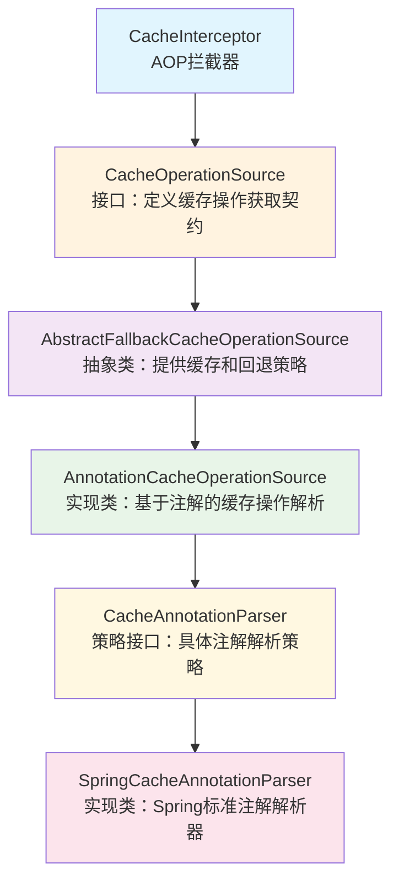
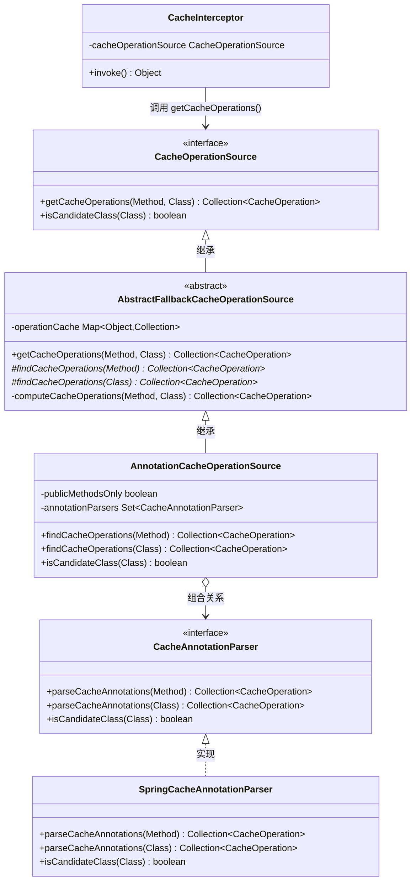
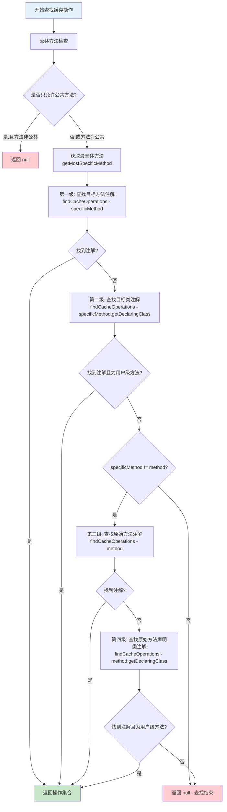
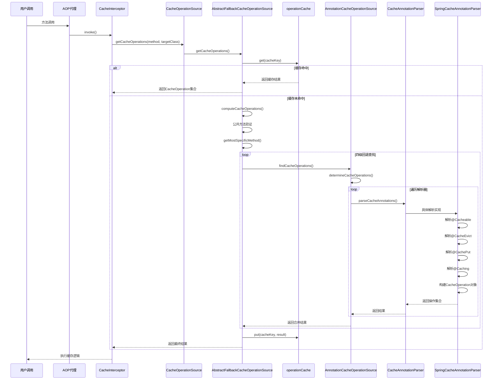
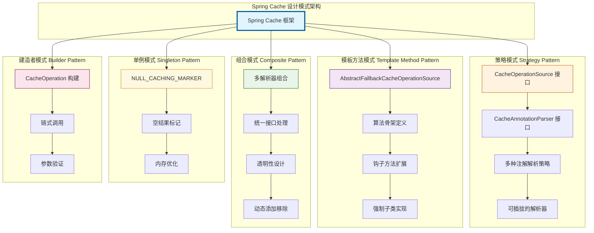
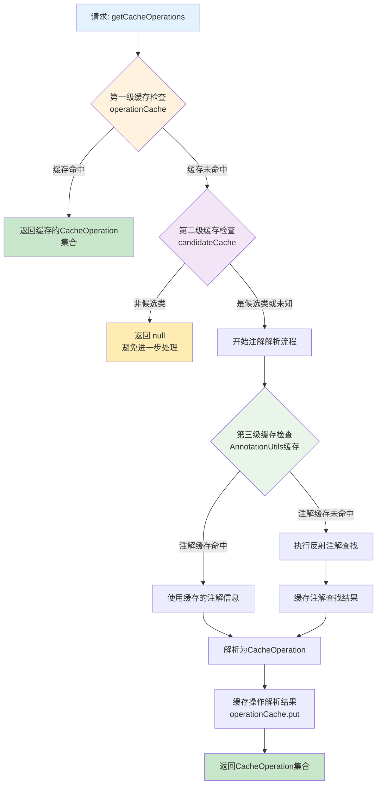
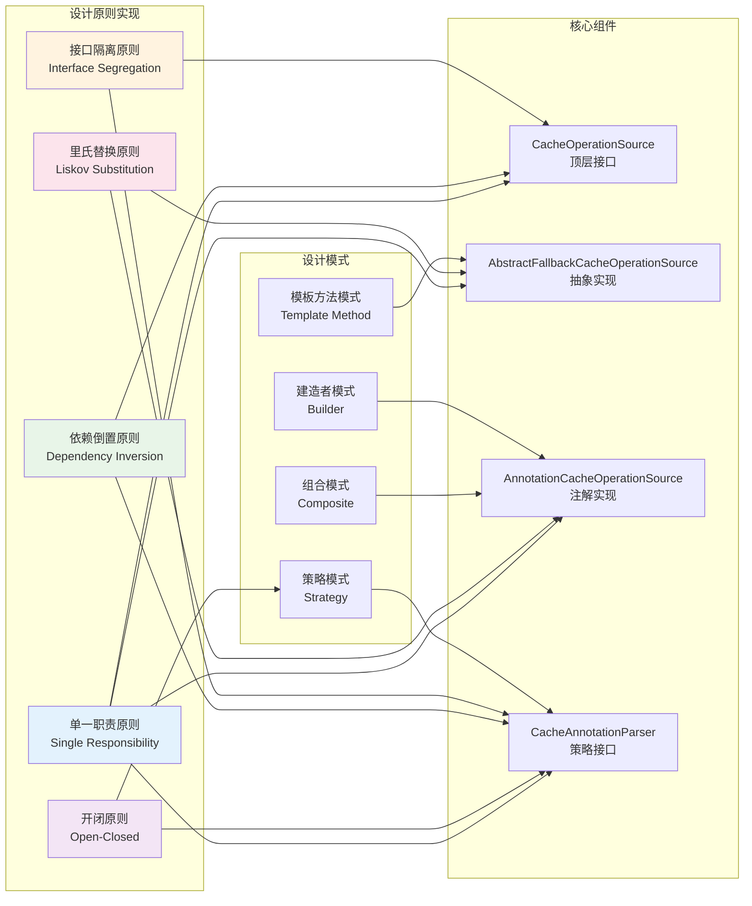

## 概述

本文档深入分析Spring
Cache模块中关于注解处理的核心源码，聚焦于四个关键接口与类：`CacheOperationSource`、`AbstractFallbackCacheOperationSource`、`AnnotationCacheOperationSource`和`CacheAnnotationParser`。这些组件构成了Spring
Cache注解处理的核心基础设施，理解它们的设计和协作关系对于掌握Spring Cache的工作原理至关重要。

## 组件概览

### 整体架构



### 组件关系图



## 详细组件分析

### 1. CacheOperationSource - 顶层接口定义

#### 核心职责

`CacheOperationSource`作为Spring Cache体系的顶层接口，定义了获取缓存操作元数据的核心契约。

#### 关键设计模式

采用**策略模式**，为不同的缓存操作获取策略（如基于注解、XML配置等）提供统一接口。

#### 源码分析要点

**接口定义分析：**

```java
public interface CacheOperationSource {

    // 核心方法：获取方法的缓存操作集合
    @Nullable
    Collection<CacheOperation> getCacheOperations(Method method, @Nullable Class<?> targetClass);

    // 优化方法：判断类是否为候选类，避免不必要的方法遍历
    default boolean isCandidateClass(Class<?> targetClass) {
        return true;
    }
}
```

**方法签名解读：**

1. **`getCacheOperations(Method method, @Nullable Class<?> targetClass)`**

- **输入参数**：
    - `method`：需要分析的目标方法，永远不为null
    - `targetClass`：目标类，可能为null（当为null时使用方法的声明类）
- **返回值**：`Collection<CacheOperation>` - 该方法关联的所有缓存操作，如果没有找到缓存操作则返回null
- **语义**：这是整个缓存框架的入口点，负责将方法调用转换为具体的缓存操作指令

2. **`isCandidateClass(Class<?> targetClass)`**

- **优化作用**：在遍历类的所有方法之前，先快速判断该类是否可能包含缓存注解
- **性能考虑**：返回false可以直接跳过整个类，避免昂贵的方法级别检查
- **默认实现**：返回true，意味着需要完整检查（保守策略）

### 2. AbstractFallbackCacheOperationSource - 抽象骨架实现

#### 核心职责

`AbstractFallbackCacheOperationSource`作为骨架实现，提供了缓存机制和回退查找策略，是模板方法模式的经典应用。

#### 关键设计模式

采用**模板方法模式**，定义了缓存操作获取的算法骨架，将具体的查找逻辑延迟到子类实现。

#### 源码分析要点

**核心字段分析：**

```java
public abstract class AbstractFallbackCacheOperationSource implements CacheOperationSource {

    // 空标记，用于标识没有找到缓存操作的方法，避免重复查找
    private static final Collection<CacheOperation> NULL_CACHING_MARKER = Collections.emptyList();

    // 操作缓存：避免重复解析同一个方法的缓存操作
    // Key: MethodClassKey(method, targetClass)
    // Value: Collection<CacheOperation> 或 NULL_CACHING_MARKER
    private final Map<Object, Collection<CacheOperation>> operationCache = new ConcurrentHashMap<>(1024);
}
```

**缓存机制设计分析：**

1. **为什么需要`operationCache`？**

- **性能优化**：注解解析是相对昂贵的操作（涉及反射、注解查找等）
- **频繁调用**：同一个方法在应用运行期间会被多次调用
- **不变性**：方法的缓存操作在运行时是不变的，适合缓存

2. **`NULL_CACHING_MARKER`的作用：**

- **避免重复查找**：对于不包含缓存注解的方法，避免每次都进行完整的解析流程
- **区分状态**：区分"尚未查找"和"查找过但没有找到"两种状态
- **内存优化**：使用单例空集合，节省内存空间

**getCacheOperations方法实现分析：**

```java
@Override
@Nullable
public Collection<CacheOperation> getCacheOperations(Method method, @Nullable Class<?> targetClass) {
    // 1. 排除Object类的方法（如toString、equals等）
    if (method.getDeclaringClass() == Object.class) {
        return null;
    }

    // 2. 生成缓存键
    Object cacheKey = getCacheKey(method, targetClass);

    // 3. 检查缓存
    Collection<CacheOperation> cached = this.operationCache.get(cacheKey);

    if (cached != null) {
        // 4. 缓存命中：返回实际结果或null（如果是NULL_CACHING_MARKER）
        return (cached != NULL_CACHING_MARKER ? cached : null);
    }
    else {
        // 5. 缓存未命中：执行实际查找逻辑
        Collection<CacheOperation> cacheOps = computeCacheOperations(method, targetClass);

        // 6. 缓存结果
        if (cacheOps != null) {
            this.operationCache.put(cacheKey, cacheOps);
        }
        else {
            // 缓存"没有找到"的结果，避免重复查找
            this.operationCache.put(cacheKey, NULL_CACHING_MARKER);
        }
        return cacheOps;
    }
}
```

**缓存键生成策略：**

```java
protected Object getCacheKey(Method method, @Nullable Class<?> targetClass) {
    return new MethodClassKey(method, targetClass);
}
```

- **唯一性保证**：`MethodClassKey`确保不同方法产生不同的键，相同方法产生相同的键
- **重载方法支持**：能够正确区分方法重载的情况
- **代理兼容**：考虑到AOP代理的情况，`targetClass`可能与`method.getDeclaringClass()`不同

**回退查找策略分析：**

```java
@Nullable
private Collection<CacheOperation> computeCacheOperations(Method method, @Nullable Class<?> targetClass) {
    // 1. 公共方法检查
    if (allowPublicMethodsOnly() && !Modifier.isPublic(method.getModifiers())) {
        return null;
    }

    // 2. 获取最具体的方法（处理接口代理情况）
    Method specificMethod = AopUtils.getMostSpecificMethod(method, targetClass);

    // 3. 四级回退查找策略：

    // 第一级：查找目标方法上的注解
    Collection<CacheOperation> opDef = findCacheOperations(specificMethod);
    if (opDef != null) {
        return opDef;
    }

    // 第二级：查找目标类上的注解
    opDef = findCacheOperations(specificMethod.getDeclaringClass());
    if (opDef != null && ClassUtils.isUserLevelMethod(method)) {
        return opDef;
    }

    // 第三级：如果方法不同，查找原始方法上的注解
    if (specificMethod != method) {
        opDef = findCacheOperations(method);
        if (opDef != null) {
            return opDef;
        }

        // 第四级：查找原始方法声明类上的注解
        opDef = findCacheOperations(method.getDeclaringClass());
        if (opDef != null && ClassUtils.isUserLevelMethod(method)) {
            return opDef;
        }
    }

    return null;
}
```

**回退策略的设计理念：**

1. **优先级递减**：方法级注解 > 类级注解 > 接口方法注解 > 接口类注解
2. **就近原则**：越接近实际调用点的注解优先级越高
3. **覆盖机制**：方法级注解完全覆盖类级注解，而不是合并
4. **代理兼容**：正确处理JDK动态代理和CGLIB代理的情况

**四级回退查找策略流程图：**



**模板方法的体现：**

```java
// 抽象方法：由子类实现具体的查找逻辑
@Nullable
protected abstract Collection<CacheOperation> findCacheOperations(Class<?> clazz);

@Nullable
protected abstract Collection<CacheOperation> findCacheOperations(Method method);
```

### 3. AnnotationCacheOperationSource - 标准注解解析实现

#### 核心职责

`AnnotationCacheOperationSource`作为基于注解的缓存操作解析器，利用策略模式与多个`CacheAnnotationParser`协作，支持不同类型的缓存注解。

#### 关键设计模式

采用**策略模式 + 组合模式**，通过组合多个注解解析策略来支持不同的注解体系（如Spring标准注解、JCache注解等）。

#### 源码分析要点

**核心字段和构造器分析：**

```java
public class AnnotationCacheOperationSource extends AbstractFallbackCacheOperationSource implements Serializable {

    private final boolean publicMethodsOnly;
    private final Set<CacheAnnotationParser> annotationParsers;

    // 默认构造器：只支持公共方法，使用Spring标准注解解析器
    public AnnotationCacheOperationSource() {
        this(true);
    }

    // 基本构造器：配置方法可见性，默认使用Spring标准注解解析器
    public AnnotationCacheOperationSource(boolean publicMethodsOnly) {
        this.publicMethodsOnly = publicMethodsOnly;
        this.annotationParsers = Collections.singleton(new SpringCacheAnnotationParser());
    }

    // 自定义解析器构造器：支持单个自定义解析器
    public AnnotationCacheOperationSource(CacheAnnotationParser annotationParser) {
        this.publicMethodsOnly = true;
        Assert.notNull(annotationParser, "CacheAnnotationParser must not be null");
        this.annotationParsers = Collections.singleton(annotationParser);
    }

    // 多解析器构造器：支持多个解析器组合
    public AnnotationCacheOperationSource(Set<CacheAnnotationParser> annotationParsers) {
        this.publicMethodsOnly = true;
        Assert.notEmpty(annotationParsers, "At least one CacheAnnotationParser needs to be specified");
        this.annotationParsers = annotationParsers;
    }
}
```

**构造器设计分析：**

1. **渐进式复杂度**：从简单的默认配置到完全自定义配置
2. **合理默认值**：默认只处理公共方法，使用Spring标准解析器
3. **扩展性支持**：支持添加自定义解析器，支持多解析器组合
4. **参数验证**：确保解析器集合不为空，体现防御性编程

**候选类检查实现：**

```java
@Override
public boolean isCandidateClass(Class<?> targetClass) {
    for (CacheAnnotationParser parser : this.annotationParsers) {
        if (parser.isCandidateClass(targetClass)) {
            return true;
        }
    }
    return false;
}
```

- **短路优化**：任一解析器认为是候选类即返回true
- **委托模式**：将具体判断逻辑委托给各个解析器
- **性能优化**：避免对无关类进行昂贵的方法遍历

**核心解析方法实现：**

```java
@Override
@Nullable
protected Collection<CacheOperation> findCacheOperations(Class<?> clazz) {
    return determineCacheOperations(parser -> parser.parseCacheAnnotations(clazz));
}

@Override
@Nullable
protected Collection<CacheOperation> findCacheOperations(Method method) {
    return determineCacheOperations(parser -> parser.parseCacheAnnotations(method));
}
```

**策略模式的核心实现：**

```java
@Nullable
protected Collection<CacheOperation> determineCacheOperations(CacheOperationProvider provider) {
    Collection<CacheOperation> ops = null;

    // 遍历所有注解解析器
    for (CacheAnnotationParser parser : this.annotationParsers) {
        // 使用当前解析器解析注解
        Collection<CacheOperation> annOps = provider.getCacheOperations(parser);

        if (annOps != null) {
            if (ops == null) {
                // 第一次发现操作
                ops = annOps;
            }
            else {
                // 合并多个解析器的结果
                Collection<CacheOperation> combined = new ArrayList<>(ops.size() + annOps.size());
                combined.addAll(ops);
                combined.addAll(annOps);
                ops = combined;
            }
        }
    }
    return ops;
}
```

**函数式接口设计：**

```java
@FunctionalInterface
protected interface CacheOperationProvider {
    @Nullable
    Collection<CacheOperation> getCacheOperations(CacheAnnotationParser parser);
}
```

**determineCacheOperations方法的设计亮点：**

1. **函数式编程**：使用`CacheOperationProvider`函数式接口，提高代码复用性
2. **延迟计算**：只有在需要时才创建合并集合
3. **内存优化**：当只有一个解析器有结果时，直接返回原集合，避免不必要的复制
4. **结果合并**：支持多个解析器的结果合并，实现注解体系的扩展

### 4. CacheAnnotationParser - 策略接口扩展点

#### 核心职责

`CacheAnnotationParser`作为注解解析的策略接口，为Spring Cache体系提供了强大的扩展点，支持不同的注解标准和自定义注解。

#### 关键设计模式

采用**策略模式**，为不同的注解解析策略提供统一接口，是整个注解体系扩展性的关键。

#### 源码分析要点

**接口定义分析：**

```java
public interface CacheAnnotationParser {

    // 候选类检查：性能优化的关键
    default boolean isCandidateClass(Class<?> targetClass) {
        return true;
    }

    // 解析类级别的缓存注解
    @Nullable
    Collection<CacheOperation> parseCacheAnnotations(Class<?> type);

    // 解析方法级别的缓存注解
    @Nullable
    Collection<CacheOperation> parseCacheAnnotations(Method method);
}
```

**接口设计的扩展性体现：**

1. **`isCandidateClass`方法的意义：**

```java
default boolean isCandidateClass(Class<?> targetClass) {
    return true;  // 保守的默认实现
}
```

- **性能优化作用**：在解析注解之前快速过滤无关的类
- **默认实现**：返回true确保向后兼容
- **自定义空间**：子类可以根据注解特征实现快速判断逻辑

2. **`parseCacheAnnotations`方法的统一性：**

- **一致的方法签名**：类和方法级别的解析采用相同的返回类型
- **null语义**：返回null表示没有找到相关注解
- **集合返回**：支持一个元素上有多个缓存操作（如@Caching注解）

**SpringCacheAnnotationParser实现示例：**

```java
public class SpringCacheAnnotationParser implements CacheAnnotationParser {

    @Override
    public boolean isCandidateClass(Class<?> targetClass) {
        // 检查类上是否有Spring Cache相关注解
        return AnnotationUtils.isCandidateClass(targetClass, CACHE_OPERATION_ANNOTATIONS);
    }

    @Override
    @Nullable
    public Collection<CacheOperation> parseCacheAnnotations(Class<?> type) {
        DefaultCacheConfig defaultConfig = new DefaultCacheConfig(type);
        return parseCacheAnnotations(defaultConfig, type);
    }

    @Override
    @Nullable
    public Collection<CacheOperation> parseCacheAnnotations(Method method) {
        DefaultCacheConfig defaultConfig = new DefaultCacheConfig(method.getDeclaringClass());
        return parseCacheAnnotations(defaultConfig, method);
    }
}
```

**扩展点的价值：**

1. **多标准支持**：可以同时支持Spring Cache注解、JCache注解、自定义注解
2. **渐进迁移**：支持从一种注解标准向另一种标准迁移
3. **业务定制**：支持根据业务需求定制特殊的缓存注解
4. **第三方集成**：第三方缓存框架可以通过实现此接口集成到Spring Cache体系

## 完整调用链路分析

### 方法调用时序图



### 关键调用路径详解

1. **入口调用：**

```java
// CacheInterceptor.invoke()中
Collection<CacheOperation> operations = getCacheOperationSource()
    .getCacheOperations(method, targetClass);
```

2. **缓存查找：**

```java
// AbstractFallbackCacheOperationSource.getCacheOperations()
Object cacheKey = getCacheKey(method, targetClass);
Collection<CacheOperation> cached = this.operationCache.get(cacheKey);
```

3. **回退解析：**

```java
// 四级回退策略
Collection<CacheOperation> opDef = findCacheOperations(specificMethod);
if (opDef != null) return opDef;
// ... 其他级别的回退
```

4. **策略委托：**

```java
// AnnotationCacheOperationSource.determineCacheOperations()
for (CacheAnnotationParser parser : this.annotationParsers) {
    Collection<CacheOperation> annOps = provider.getCacheOperations(parser);
    // 合并结果...
}
```

5. **注解解析：**

```java
// SpringCacheAnnotationParser.parseCacheAnnotations()
Cacheable cacheable = AnnotatedElementUtils.findMergedAnnotation(method, Cacheable.class);
if (cacheable != null) {
    ops.add(parseCacheableAnnotation(cacheable, method));
}
```

## 设计模式深度解析

**Spring Cache 架构中应用的设计模式总览：**



### 1. 模板方法模式在AbstractFallbackCacheOperationSource中的应用

**模板结构：**

```java
public abstract class AbstractFallbackCacheOperationSource {

    // 模板方法：定义算法骨架
    public final Collection<CacheOperation> getCacheOperations(Method method, Class<?> targetClass) {
        // 1. 预处理：检查Object类方法
        // 2. 缓存查找
        // 3. 如果缓存未命中，调用computeCacheOperations
        // 4. 结果缓存
    }

    // 钩子方法：子类可以覆盖的行为
    protected boolean allowPublicMethodsOnly() {
        return false;
    }

    // 抽象方法：强制子类实现
    protected abstract Collection<CacheOperation> findCacheOperations(Class<?> clazz);
    protected abstract Collection<CacheOperation> findCacheOperations(Method method);
}
```

**优势分析：**

1. **算法复用**：缓存逻辑、回退策略在所有子类中都相同
2. **扩展点明确**：子类只需关注具体的注解查找逻辑
3. **一致性保证**：所有实现都遵循相同的执行流程

### 2. 策略模式在注解解析中的应用

**策略接口：**

```java
public interface CacheAnnotationParser {
    Collection<CacheOperation> parseCacheAnnotations(Class<?> type);
    Collection<CacheOperation> parseCacheAnnotations(Method method);
}
```

**策略上下文：**

```java
public class AnnotationCacheOperationSource {
    private final Set<CacheAnnotationParser> annotationParsers;

    protected Collection<CacheOperation> determineCacheOperations(CacheOperationProvider provider) {
        // 遍历所有策略，合并结果
    }
}
```

**具体策略：**

- `SpringCacheAnnotationParser`：处理Spring标准注解
- `JCacheAnnotationParser`：处理JCache标准注解
- 自定义解析器：处理业务特定注解

**优势分析：**

1. **开闭原则**：可以添加新的注解标准而不修改现有代码
2. **职责分离**：每个解析器只关注特定的注解类型
3. **组合灵活**：可以同时使用多种注解标准

### 3. 组合模式的应用

**组合结构：**

```java
AnnotationCacheOperationSource {
    Set<CacheAnnotationParser> annotationParsers;  // 叶子节点集合

    determineCacheOperations() {
        // 遍历所有叶子节点，收集结果
        for (CacheAnnotationParser parser : annotationParsers) {
            // 调用叶子节点的处理方法
        }
    }
}
```

**优势分析：**

1. **统一处理**：对单个解析器和解析器集合使用相同的接口
2. **透明性**：客户端不需要知道是在处理单个解析器还是解析器集合
3. **扩展性**：可以动态添加或移除解析器

## 性能优化策略分析

### 1. 多级缓存设计

**缓存层次：**

```java
// 第一级：操作结果缓存
private final Map<Object, Collection<CacheOperation>> operationCache;

// 第二级：候选类预检查缓存（在实际实现中可能存在）
private final Map<Class<?>, Boolean> candidateCache;

// 第三级：注解查找结果缓存（在AnnotationUtils中）
```

**多级缓存架构图：**



**缓存键设计：**

```java
protected Object getCacheKey(Method method, @Nullable Class<?> targetClass) {
    return new MethodClassKey(method, targetClass);
}
```

- **唯一性**：确保不同方法有不同的键
- **一致性**：相同方法始终产生相同的键
- **高效性**：基于方法和类的hashCode计算

### 2. 延迟计算和短路优化

**候选类短路：**

```java
public boolean isCandidateClass(Class<?> targetClass) {
    for (CacheAnnotationParser parser : this.annotationParsers) {
        if (parser.isCandidateClass(targetClass)) {
            return true;  // 短路返回
        }
    }
    return false;
}
```

**空结果标记：**

```java
private static final Collection<CacheOperation> NULL_CACHING_MARKER = Collections.emptyList();

// 避免重复查找已知无结果的方法
if (cached != null) {
    return (cached != NULL_CACHING_MARKER ? cached : null);
}
```

### 3. 内存优化

**集合复用：**

```java
// 只有在需要合并时才创建新集合
if (ops == null) {
    ops = annOps;  // 直接引用，避免复制
}
else {
    // 确实需要合并时才创建新集合
    Collection<CacheOperation> combined = new ArrayList<>(ops.size() + annOps.size());
    combined.addAll(ops);
    combined.addAll(annOps);
    ops = combined;
}
```

**不可变集合：**

```java
return Collections.unmodifiableList(ops);  // 返回不可变视图，防止意外修改
```

## 实际案例研究：RedisCacheOperationSource

为了更好地理解如何实现自定义的`CacheOperationSource`，让我们分析一个实际案例：来自CacheGuard项目的`RedisCacheOperationSource`。这个实现展示了如何扩展Spring Cache以支持Redis特定的缓存功能。

### 案例研究概述

`RedisCacheOperationSource`扩展了`AnnotationCacheOperationSource`，支持自定义的Redis缓存注解，如`@RedisCacheable`、`@RedisCacheEvict`和`@RedisCaching`。这个实现展现了几个关键的设计原则：

1. **扩展而非替换**：扩展现有的Spring Cache基础设施
2. **自定义注解支持**：处理Redis特定的缓存注解
3. **全面验证**：提供健壮的错误检查和日志记录
4. **复合注解处理**：支持复杂的注解组合

**RedisCacheOperationSource 架构图：**

```mermaid
graph TB
    subgraph "Spring Cache 核心"
        A[AbstractFallbackCacheOperationSource<br/>抽象骨架实现]
        B[AnnotationCacheOperationSource<br/>注解解析实现]
        A --> B
    end

    subgraph "自定义扩展"
        C[RedisCacheOperationSource<br/>Redis特定实现]
        B --> C
    end

    subgraph "支持的注解"
        D[@RedisCacheable<br/>Redis缓存注解]
        E[@RedisCacheEvict<br/>Redis缓存清除注解]
        F[@RedisCaching<br/>Redis复合注解]
    end

    subgraph "处理流程"
        G[parseCacheAnnotations<br/>统一注解解析]
        H[parseRedisCacheable<br/>解析@RedisCacheable]
        I[parseRedisCacheEvict<br/>解析@RedisCacheEvict]
        J[parseRedisCaching<br/>解析@RedisCaching]
        K[validateCacheOperation<br/>验证配置]
    end

    C --> G
    G --> H
    G --> I
    G --> J
    H --> K
    I --> K
    J --> K

    D -.-> H
    E -.-> I
    F -.-> J

    style C fill:#e8f5e8
    style D fill:#fff3e0
    style E fill:#fff3e0
    style F fill:#fff3e0
    style K fill:#ffecb3
```

### 实现分析

#### 1. 核心结构

```java
@Slf4j
public class RedisCacheOperationSource extends AnnotationCacheOperationSource {

    public RedisCacheOperationSource() {
        super(false);  // 允许非公共方法
    }

    @Override
    protected Collection<CacheOperation> findCacheOperations(Method method) {
        return parseCacheAnnotations(method);
    }

    @Override
    protected Collection<CacheOperation> findCacheOperations(Class<?> clazz) {
        return parseCacheAnnotations(clazz);
    }
}
```

**设计决策：**

- **构造函数参数**：`super(false)`允许处理非公共方法，提供比Spring默认行为更大的灵活性
- **模板方法实现**：重写父类的抽象方法，委托给自定义的解析逻辑
- **统一解析**：使用单个`parseCacheAnnotations(Object target)`方法处理类和方法目标

#### 2. 自定义注解解析策略

```java
@Nullable
private Collection<CacheOperation> parseCacheAnnotations(Object target) {
    List<CacheOperation> ops = new ArrayList<>();
    log.trace("Parsing cache annotations for target: {}", target);

    // 处理 @RedisCacheable 注解
    RedisCacheable cacheable = null;
    if (target instanceof Method) {
        cacheable = AnnotatedElementUtils.findMergedAnnotation(
                (Method) target, RedisCacheable.class);
    } else if (target instanceof Class) {
        cacheable = AnnotatedElementUtils.findMergedAnnotation(
                (Class<?>) target, RedisCacheable.class);
    }

    if (cacheable != null) {
        log.debug("Found @RedisCacheable annotation on target: {}", target);
        CacheOperation operation = parseRedisCacheable(cacheable, target);
        validateCacheOperation(target, operation);
        ops.add(operation);
    }

    // 处理 @RedisCaching 复合注解
    RedisCaching caching = null;
    if (target instanceof Method) {
        caching = AnnotatedElementUtils.findMergedAnnotation((Method) target, RedisCaching.class);
    } else if (target instanceof Class) {
        caching = AnnotatedElementUtils.findMergedAnnotation((Class<?>) target, RedisCaching.class);
    }

    if (caching != null) {
        log.debug("Found @RedisCaching annotation on target: {}", target);
        // 处理多个嵌套注解
        for (RedisCacheable c : caching.redisCacheable()) {
            CacheOperation operation = parseRedisCacheable(c, target);
            validateCacheOperation(target, operation);
            ops.add(operation);
        }
        for (RedisCacheEvict e : caching.redisCacheEvict()) {
            RedisCacheEvictOperation operation = parseRedisCacheEvict(e, target);
            validateCacheOperation(target, operation);
            ops.add(operation);
        }
    }

    return ops.isEmpty() ? null : Collections.unmodifiableList(ops);
}
```

**应用的关键设计模式：**

1. **多态目标处理**：使用`Object target`参数统一处理`Method`和`Class`类型
2. **合并注解支持**：使用`AnnotatedElementUtils.findMergedAnnotation()`支持注解继承和元注解
3. **组合模式**：通过相同接口处理单个注解和复合注解
4. **防御性编程**：每一步都进行全面的日志记录和验证

#### 3. 注解到操作的转换

```java
private CacheOperation parseRedisCacheable(RedisCacheable ann, Object target) {
    String name = (target instanceof Method) ? ((Method) target).getName() : target.toString();
    log.trace("Parsing @RedisCacheable annotation for target: {}", target);

    // 使用标准的Spring CacheableOperation.Builder
    CacheableOperation.Builder builder = new CacheableOperation.Builder();
    builder.setName(name);
    builder.setCacheNames(ann.value().length > 0 ? ann.value() : ann.cacheNames());

    // 仅在存在时设置key
    if (StringUtils.hasText(ann.key())) {
        builder.setKey(ann.key());
    }

    // 仅在存在时设置condition
    if (StringUtils.hasText(ann.condition())) {
        builder.setCondition(ann.condition());
    }

    builder.setSync(ann.sync());

    // 仅在指定时设置keyGenerator
    if (StringUtils.hasText(ann.keyGenerator())) {
        builder.setKeyGenerator(ann.keyGenerator());
    }

    CacheableOperation operation = builder.build();
    log.debug("Built CacheableOperation: {}", operation);
    return operation;
}
```

**建造者模式的卓越应用：**

- **流畅接口**：使用Spring内置的`CacheableOperation.Builder`实现清晰、可读的代码
- **条件设置**：仅在有意义的值时设置属性，避免空字符串污染
- **标准兼容**：重用Spring的标准操作类以实现最大兼容性

#### 4. 全面的验证框架

```java
private void validateCacheOperation(Object target, CacheOperation operation) {
    log.trace("Validating cache operation for target: {}", target);

    // 验证key与keyGenerator的互斥性
    if (StringUtils.hasText(operation.getKey()) &&
        StringUtils.hasText(operation.getKeyGenerator())) {
        String errorMsg = "Invalid cache annotation configuration on '" + target +
                         "'. Both 'key' and 'keyGenerator' attributes have been set. " +
                         "These attributes are mutually exclusive...";
        log.error(errorMsg);
        throw new IllegalStateException(errorMsg);
    }

    // 验证缓存名称的存在性
    if (operation.getCacheNames().isEmpty()) {
        String errorMsg = "Invalid cache annotation configuration on '" + target +
                         "'. At least one cache name must be specified.";
        log.error(errorMsg);
        throw new IllegalStateException(errorMsg);
    }

    log.debug("Cache operation validation passed for target: {}", target);
}
```

**验证策略的优势：**

1. **早期错误检测**：在启动时而非运行时捕获配置错误
2. **清晰的错误消息**：提供详细的、可操作的错误消息
3. **快速失败原则**：对无效配置抛出`IllegalStateException`
4. **全面覆盖**：验证所有关键配置组合

### 案例研究中的设计模式应用

#### 1. 模板方法模式的使用

```java
public class RedisCacheOperationSource extends AnnotationCacheOperationSource {
    // 从父类继承缓存和回退逻辑

    @Override
    protected Collection<CacheOperation> findCacheOperations(Method method) {
        return parseCacheAnnotations(method);  // 自定义实现
    }

    @Override
    protected Collection<CacheOperation> findCacheOperations(Class<?> clazz) {
        return parseCacheAnnotations(clazz);   // 自定义实现
    }
}
```

**实现的优势：**

- **代码复用**：继承父类的缓存、回退和性能优化
- **专注核心逻辑**：只需实现注解解析逻辑
- **一致性**：遵循与标准Spring实现相同的执行模式

#### 2. 多注解的策略模式

```java
private Collection<CacheOperation> parseCacheAnnotations(Object target) {
    List<CacheOperation> ops = new ArrayList<>();

    // 策略1：处理@RedisCacheable
    RedisCacheable cacheable = findAnnotation(target, RedisCacheable.class);
    if (cacheable != null) {
        ops.add(parseRedisCacheable(cacheable, target));
    }

    // 策略2：处理@RedisCacheEvict
    RedisCacheEvict cacheEvict = findAnnotation(target, RedisCacheEvict.class);
    if (cacheEvict != null) {
        ops.add(parseRedisCacheEvict(cacheEvict, target));
    }

    // 策略3：处理@RedisCaching复合注解
    RedisCaching caching = findAnnotation(target, RedisCaching.class);
    if (caching != null) {
        // 处理多个嵌套注解
    }

    return ops.isEmpty() ? null : Collections.unmodifiableList(ops);
}
```

### 案例研究的关键要点

1. **扩展策略**：扩展`AnnotationCacheOperationSource`最大化利用Spring现有基础设施
2. **验证重要性**：全面验证防止运行时错误并提供清晰反馈
3. **日志策略**：多级日志支持开发和生产调试
4. **模式应用**：实际实现展示了模板方法、策略和建造者模式的有效使用
5. **性能意识**：高效的注解处理和内存管理对高性能应用至关重要

这个案例研究展示了Spring Cache架构的理论概念如何转化为实际的、可用于生产的实现，扩展和增强了框架的能力。

## 扩展和自定义指南

### 1. 自定义CacheAnnotationParser

```java
public class CustomCacheAnnotationParser implements CacheAnnotationParser {

    @Override
    public boolean isCandidateClass(Class<?> targetClass) {
        // 快速检查是否包含自定义注解
        return AnnotationUtils.isCandidateClass(targetClass, CustomCacheable.class);
    }

    @Override
    public Collection<CacheOperation> parseCacheAnnotations(Class<?> type) {
        CustomCacheable annotation = AnnotationUtils.findAnnotation(type, CustomCacheable.class);
        if (annotation != null) {
            return Collections.singletonList(buildCacheOperation(annotation));
        }
        return null;
    }

    @Override
    public Collection<CacheOperation> parseCacheAnnotations(Method method) {
        CustomCacheable annotation = AnnotationUtils.findAnnotation(method, CustomCacheable.class);
        if (annotation != null) {
            return Collections.singletonList(buildCacheOperation(annotation));
        }
        return null;
    }

    private CacheOperation buildCacheOperation(CustomCacheable annotation) {
        // 构建自定义的CacheOperation
        return new CacheableOperation.Builder()
            .setName(annotation.value())
            .setCacheNames(annotation.cacheNames())
            .setKey(annotation.key())
            // 设置自定义属性...
            .build();
    }
}
```

### 2. 自定义CacheOperationSource

```java
public class CustomCacheOperationSource extends AbstractFallbackCacheOperationSource {

    private final CustomCacheAnnotationParser parser = new CustomCacheAnnotationParser();

    @Override
    protected Collection<CacheOperation> findCacheOperations(Class<?> clazz) {
        return parser.parseCacheAnnotations(clazz);
    }

    @Override
    protected Collection<CacheOperation> findCacheOperations(Method method) {
        return parser.parseCacheAnnotations(method);
    }
}
```

### 3. 配置自定义解析器

```java
@Configuration
public class CacheConfig {

    @Bean
    public CacheOperationSource cacheOperationSource() {
        Set<CacheAnnotationParser> parsers = new LinkedHashSet<>();
        parsers.add(new SpringCacheAnnotationParser());  // 保持Spring标准支持
        parsers.add(new CustomCacheAnnotationParser());  // 添加自定义支持
        return new AnnotationCacheOperationSource(parsers);
    }
}
```

## 总结

Spring Cache的CacheOperationSource体系展现了优秀的软件设计原则：

1. **单一职责原则**：每个组件都有明确的职责边界
2. **开闭原则**：通过策略模式支持扩展而不修改现有代码
3. **依赖倒置原则**：高层模块依赖抽象而不是具体实现
4. **接口隔离原则**：接口设计精简且职责明确
5. **里氏替换原则**：子类可以完全替换父类

**Spring Cache 架构设计原则总览：**



这种设计使得Spring Cache不仅功能强大，而且具有极强的扩展性和可维护性，为各种缓存场景提供了灵活的解决方案。通过理解这些核心组件的设计思想和实现细节，我们可以更好地使用Spring Cache，也可以借鉴这些设计模式来构建自己的可扩展系统。
